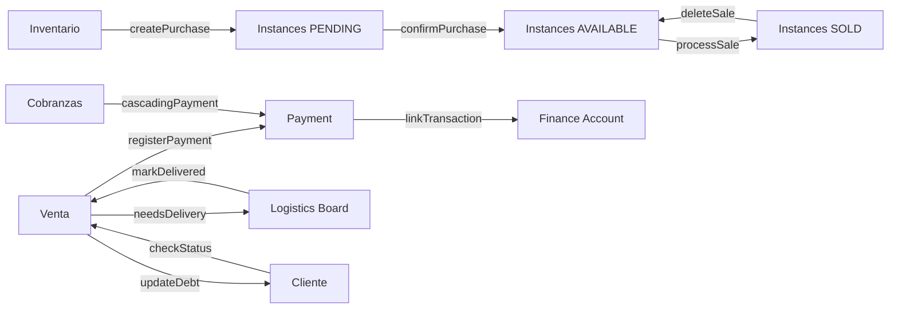

# LATIDOS — Lógica de Procesos Internos

> Sistema ERP + POS para operaciones de retail de alto rendimiento.
> Stack: Next.js 14 (App Router) + Prisma + Neon PostgreSQL + NextAuth.

---

## Arquitectura General

```
┌─────────────────────────────────────────────────────────────┐
│                    LATIDOS PLATFORM                          │
├─────────┬──────────┬───────────┬──────────┬─────────────────┤
│ VENTAS  │INVENTARIO│ LOGÍSTICA │ FINANZAS │   DIRECTORIO    │
│  (POS)  │ (Stock)  │ (Entregas)│(Tesorería)│ (CRM/Equipo)  │
├─────────┴──────────┴───────────┴──────────┴─────────────────┤
│               CAPA DE SEGURIDAD (Dual Identity)              │
├──────────────────────────────────────────────────────────────┤
│              MULTI-TENANCY (Organization Scoping)            │
└──────────────────────────────────────────────────────────────┘
```

### Multi-Tenancy
Cada query filtra por `organizationId`. Un usuario pertenece a una organización.
El `orgId` se obtiene del usuario autenticado vía NextAuth en cada server action.

### Dual Identity (PIN de Operador)
Permite que múltiples operadores usen la misma sesión (terminal compartida POS):
1. El **Session User** es quien tiene la sesión abierta en el navegador.
2. El **Operador** se autentica con PIN para cada operación sensible.
3. Cada transacción guarda `operatorId` + `operatorName` (snapshot) para auditoría.

---

## 1. MÓDULO DE VENTAS (`/sales`)

### 1.1 Flujo de Venta (POS)

```
Catálogo → Seleccionar Producto → Asignar Seriales → Asignar Cliente → Guardar Factura
```

**Archivos clave:**
- `sales/new/page.tsx` — Interfaz POS
- `sales/actions.ts` → `processSale()`
- `sales/payment-actions.ts` → `registerUnifiedPayment()`

**Proceso `processSale()`:**
1. Recibe: `customerId`, `items[]` (productId, instanceId, price, serial), `paymentMethod`, `operatorId/pin`.
2. **Validaciones:**
   - Customer existe y pertenece a la org.
   - Cada `Instance` existe, está disponible (`status: AVAILABLE`), y pertenece a la org.
   - No hay seriales duplicados en la misma venta.
3. **Creación en transacción Prisma:**
   - Crea `Sale` con status `PENDING` (si crédito) o `PAID` (si contado).
   - Crea `SaleItem[]` vinculando cada instance.
   - Cambia status de cada `Instance` a `SOLD`.
   - Si hay pago inmediato, crea `Payment` vinculado a la factura.
   - Genera número de factura único (`FAC-XXXX`).
4. **Post-venta:** Se puede ver en `/sales`, editar (`updateSale`), o eliminar (`deleteSale` — restaura instances a `AVAILABLE`).

### 1.2 Sistema de Pagos

**Archivos:** `payment-actions.ts`

| Función | Descripción |
|---------|-------------|
| `registerUnifiedPayment` | Pago único a una factura. Crea `Payment` + `Transaction` en cuenta financiera. |
| `processCascadingPayment` | Pago que se distribuye entre múltiples facturas del mismo cliente (FIFO por antigüedad). |
| `updatePayment` | Edita monto/método de un pago existente. Ajusta transacciones vinculadas. |
| `deletePayment` | Elimina pago con motivo obligatorio + firma de operador. Revierte la factura a `PENDING`. |

**Lógica de cascada:**
1. Recibe monto total + clienteId.
2. Obtiene las facturas pendientes del cliente ordenadas por fecha (más vieja primero).
3. Distribuye el monto: llena factura 1, luego factura 2, etc.
4. Cada factura pagada pasa a `PAID`, las parciales quedan `PARTIAL`.

### 1.3 Cobranzas (`/sales/collections`)

**Acciones:** `getCollectionsData()`

Genera el "Radar de Cobranza" con:
- **Cartera por vencer** (0–15 días).
- **Vencida** (>15 días).
- **Crítica** (>30 días).
- **Proyección de recaudo** (30 días futuro).
- **Gestión de clientes** — tabla con mora max, deuda total, acciones.
- **Top Deudores** — ranking por monto y antigüedad.

### 1.4 Edición de Venta (`updateSale`)
Requiere **PIN de autenticación** + **razón del cambio**.
Genera un `AuditLog` con snapshot del estado anterior para trazabilidad completa.

---

## 2. MÓDULO DE INVENTARIO (`/inventory`)

### 2.1 Modelo de Datos

```
Product (producto maestro)
  ├── name, sku, upc, basePrice, category, imageUrl
  └── Instance[] (unidades individuales)
        ├── serialNumber (único o BULK-*)
        ├── status: AVAILABLE | SOLD | RESERVED | RETURNED
        ├── condition: NEW | OPEN_BOX | USED
        └── cost, originalCost (precio de compra)
```

### 2.2 Recepción Inteligente (`/inventory/inbound`)

```
Escanear UPC → Identificar Producto → Escanear Serial(es) → Asignar Costos → Guardar
```

**Archivo:** `inventory/inbound/page.tsx` + `createPurchase()`

**Dos modos:**
- **Serializado (F1):** Escanea UPC → escanea serial individual → siguiente producto.
- **Masivo (F2):** Escanea UPC → ingresa cantidad → opcionalmente lista seriales en modal.

**Proceso `createPurchase()`:**
1. Valida proveedor, operador (PIN), items no vacíos.
2. Verifica seriales duplicados contra toda la base (`checkDuplicateSerials`).
3. Genera número de recepción único (`REC-YYYYMMDD-XXXX`).
4. Crea `Purchase` con status `DRAFT`.
5. Crea `Instance[]` — una por cada item, con status `PENDING`.
6. Manejo de moneda: si se ingresó en USD, convierte a COP usando TRM.

**Confirmación de compra (`confirmPurchase`):**
- Cambia instances de `PENDING` → `AVAILABLE` (listas para vender).
- Cambia purchase status de `DRAFT` → `CONFIRMED`.

### 2.3 Categorías

CRUD completo con `createCategory`, `updateCategory`, `getCategoriesWithCount`.
Las categorías son por organización.

### 2.4 Ajuste de Stock (`adjustStock`)

Permite ajustar manualmente el inventario con:
- **Tipos:** `ADD`, `REMOVE`, `TRANSFER`, `COUNT`, `DAMAGE`, `RETURN`.
- Cada ajuste genera un registro de auditoría (`StockAdjustment`).
- Requiere `reason` obligatorio.

### 2.5 Auditoría de Stock

Sistema de conteos cíclicos:
- Crea una sesión de auditoría (`createStockAdjustment` con type `COUNT`).
- Compara stock físico vs sistema.
- Genera diferencias y ajustes.

### 2.6 Dashboard de Inventario (`getDashboardMetrics`)

Calcula en tiempo real:
- Valor total de inventario (costo y venta).
- Margen promedio.
- Stock por categoría (distribución).
- Productos con mayor margen.
- Productos que necesitan reposición (Smart Restock).

---

## 3. MÓDULO DE LOGÍSTICA (`/logistics`)

### 3.1 Tablero Kanban (`getLogisticsBoard`)

```
PENDIENTE → EN RUTA → ENTREGADO
                   └→ CON NOVEDAD
```

**Entidades en el tablero:**
- `Sale` con `deliveryStatus != null` (ventas que requieren entrega).
- `LogisticsTask` (tareas manuales: recoger mercancía, etc.).

### 3.2 Flujo de Entrega

| Acción | Función | Efecto |
|--------|---------|--------|
| Asignar conductor | `assignDelivery()` | `deliveryStatus → IN_TRANSIT`, asigna `driverId` |
| Desasignar | `unassignDelivery()` | Devuelve a `PENDING`, limpia `driverId` |
| Cambiar a Recogida | `switchToPickup()` | `deliveryStatus → PICKUP` |
| Marcar Entregado | `markAsDelivered()` | `deliveryStatus → DELIVERED`, registra evidencia fotográfica, PIN de operador, nota |
| Reportar Novedad | `reportDeliveryIssue()` | `deliveryStatus → ISSUE`, registra comentario, opcionalmente cancela |

### 3.3 Zonas Logísticas

Agrupan entregas por sector geográfico para optimización de rutas.
`createLogisticZone()`, `seedLogisticZones()` (carga inicial).

### 3.4 Historial y KPIs

- `getLogisticsHistory()` — entregas pasadas con filtros de fecha.
- `getLogisticsKPIs()` — tasa de entrega, tiempo promedio, entregas por conductor.
- `getLogisticsDailyStats()` — resumen del día actual.

---

## 4. MÓDULO DE FINANZAS (`/finance`)

### 4.1 Cuentas de Pago (`PaymentAccount`)

| Tipo | Uso |
|------|-----|
| `CASH` | Efectivo físico |
| `BANK` | Cuentas bancarias |
| `WALLET` | Billeteras digitales (Nequi, Daviplata) |
| `RETOMA` | Valor de equipos recibidos como parte de pago |
| `NOTA_CREDITO` | Notas crédito internas |

CRUD: `createPaymentAccount`, `updateAccount`, `archiveAccount`, `deleteAccount`.

### 4.2 Transacciones

```
PaymentAccount ← Transaction (INCOME | EXPENSE | TRANSFER)
```

**`createTransaction()`:**
1. Valida cuenta + operador (Dual ID).
2. Crea `Transaction` con monto, tipo, categoría, descripción.
3. Actualiza balance de la cuenta (`increment/decrement`).

**`transferFunds()`:**
1. Crea 2 transacciones en una sola transacción Prisma:
   - `EXPENSE` en cuenta origen.
   - `INCOME` en cuenta destino.
2. Actualiza balances de ambas cuentas atómicamente.

**`splitTransferFunds()`:**
- Distribución de un monto entre múltiples cuentas destino (ej: dividir efectivo entre caja y banco).

### 4.3 Dashboard Financiero (`getFinanceMetrics`)

- Ingresos vs Gastos (periodo configurable).
- Balance total (suma de todas las cuentas).
- Últimas transacciones.
- Verificación de movimientos (`toggleTransactionVerification`).

### 4.4 Comisiones (`/finance/commissions`)

Calcula comisiones por vendedor basado en ventas realizadas en un periodo.

### 4.5 Reconciliación (`getReconciliationDashboardMetrics`)

Cruce entre pagos registrados y transacciones en cuentas — detecta desbalances.

---

## 5. MÓDULO DE DIRECTORIO (`/directory`)

### 5.1 Clientes (`/directory/customers`)

- CRUD: `createCustomer`, `updateCustomer`, `bulkDeleteCustomers`.
- **Import masivo:** `bulkCreateCustomers` (CSV).
- **Métricas:** `getCustomersWithMetrics()` — deuda total, facturas pendientes, mora máxima.
- **Scoring:** Sistema de puntuación que combina volumen de compra + velocidad de pago.
- **Status Check:** `checkCustomerStatus()` — verifica si tiene deuda vencida antes de permitir nueva venta.

### 5.2 Proveedores (`/directory/providers`)

CRUD independiente con búsqueda y asignación a compras/recepciones.

### 5.3 Equipo (`/directory/team`)

- Gestión de operadores con PIN.
- Roles: `ADMIN`, `VENDEDOR`, `OPERADOR`, `CONDUCTOR`.
- `verifyOperatorPin()` — verificación central usada por todos los módulos.

---

## 6. SEGURIDAD Y AUDITORÍA

### 6.1 Autenticación

| Capa | Mecanismo |
|------|-----------|
| Sesión | NextAuth (email/contraseña) |
| Operador | PIN de 4-6 dígitos (hasheado con bcrypt) |
| Middleware | Protege rutas `/dashboard/*`, `/sales/*`, etc. |

### 6.2 Audit Trail

Operaciones sensibles generan `AuditLog`:
- **Edición de venta** — snapshot del estado anterior.
- **Eliminación de pago** — razón + operador.
- **Ajuste de stock** — tipo + razón + cantidades.

### 6.3 Multi-Tenancy

Cada tabla tiene `organizationId`. Todos los queries lo filtran automáticamente via `getOrgId()`.

---

## 7. FLUJOS DE DATOS ENTRE MÓDULOS



### Ciclo de Vida de una Unidad (Instance)

```
CREACIÓN (Recepción)     →  PENDING
CONFIRMACIÓN             →  AVAILABLE
VENTA                    →  SOLD
  └─ ELIMINACIÓN VENTA   →  AVAILABLE (rollback)
  └─ DEVOLUCIÓN          →  RETURNED
AJUSTE (daño/pérdida)    →  REMOVED
```

### Ciclo de Vida de una Venta

```
CREACIÓN
  ├─ Contado (pago completo)  →  PAID
  └─ Crédito (sin pago)       →  PENDING
       ├─ Pago parcial        →  PARTIAL
       ├─ Pago completo       →  PAID
       └─ Vencimiento         →  OVERDUE (calculado)
```

---

## 8. ESTRUCTURA DE ARCHIVOS POR MÓDULO

```
src/app/{modulo}/
├── page.tsx              # Página principal del módulo
├── actions.ts            # Server Actions (lógica de negocio)
├── components/           # Componentes específicos del módulo
│   ├── Dashboard*.tsx    # Widgets y gráficas
│   └── *Modal.tsx        # Modales de acciones
└── [subruta]/            # Sub-páginas (ej: /sales/[id], /inventory/new)

src/components/           # Componentes compartidos
├── ui/                   # Primitivos (Button, Badge, Select, etc.)
├── auth/                 # PinValidationModal, etc.
├── sales/                # ProductCatalog, SerialSelector, etc.
└── inventory/            # ProductForm, ProductDetail, etc.
```

---

> **Nota:** Todas las funciones de `actions.ts` son **Server Actions** de Next.js — se ejecutan en el servidor y se invocan directamente desde componentes `"use client"` sin necesidad de endpoints REST.
